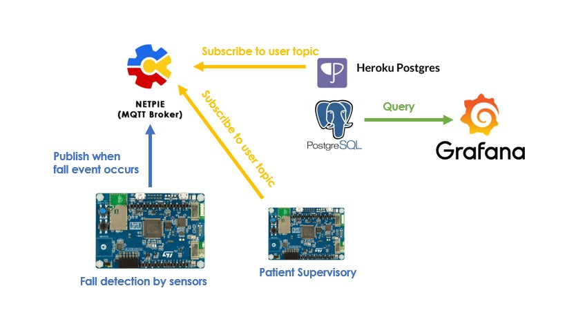

# Fall detection
### This device was created to detect the fall of the elderly. Wherever the elderly are, they are able to detect. and alert when there is a fall on the cloud to let the caretaker know

### Our system has 3 main components, namely sensor boards that detect fall on the elderly, MQTT and Dashbord.

###System Design

## Project Members
#### Device Team
- Kanittha    Rungyaem    6214552611
- Jantakarn   Makma       6214552620
- Suphidchaya Atthaporn   6222040427

#### Cloud Team
- Phat        Burana        6222040179
- Pattareeya  Piravechsakul 6214552654
- Pakpoom     Imphaiboon    6222040419

## Table of Contents
- System shall consist of **DEVICE, SERVER** and **FRONTEND**
1. [Device](#Device)
2. [Cloud](#Cloud)
3. [Dashboard](#Dashboard)
4. [Test case](#Testcase)

## Device

## Cloud
###Design
#### Heroku Python app
- Subscribe to fall alert topic of the patient
  * @msg/fallevent/<patient_name>  (Specific)
  * @msg/fallevent/#               (Multi-level wildcard)
- Receive a fall message then classify which user topic it belongs to.
- Log the fall event with the corresponding event time into the database. 
#### PostgreSQL Database 
- Directed by the database own URL from Heroku Postgres addon.
- Contains only one table. Each patient occupies 1 column.
- The patient supervisory could also be notified by subscribe to all or specific patient.
- The application are also able to summarize the data in the database to a appropriate type to a periodically request dashboard.

## Dashboard

## Testcase
### Test case: Not Fall Detection device
- Test Case ID: 001
- Description
	- This test shall show when the elder performs normal movement, there will not notify on display.
- Procedure
	1. Connect boart to computer
	2. Test the movement by holding the board and moving slowly.
- Test Device
	- Check movement accuracy
- Expected Result
	- Display shall not show Fall detected because display shall notify only when the elder fall.

### Test case: Fall Detection
- Test Case ID: #001
- Description
	- Examine the fall of the elderly, which will be detected when the elderly fall.
- Procedure
	1. Connect the board to the computer to test for fall.
	2. Test by dropped the board to simulate the fall.
- Test Device
	- Check movement accuracy
- Expected Result
	- Fall detected was a show in display and the board will have a bright LED for about 2 seconds.

### Test case: Test MQTT
- Test Case ID: ##001
- Description
	- Show that MQTT can connect on NETPIE. 
- Procedure
	1. Connect board and MQTT server together.
- Test Device
	- Send Fall Detection message to MQTT.
- Expected Result
	- Show status connected on NETPIE.

### Test Case : Server Data Sorting
- Test Case ID : ###001
- Description
	- This test shall show whether the application handle the incoming MQTT messages correctly with their corresponding database column
- Procedure
	1. Publish a test MQTT messages
	2. Change MQTT topics
	3. Verify data in the database
- Test Data
	- Various MQTT topics
- Expected Result
	- App shall assigned the payload to the database column according to the received MQTT topic

### Test Case : Get Request endpoint
- Test Case ID : ####001
- Description
	- In order to summarize the database, the server needs to provide the correct response for the request
- Procedure
	1. Perform a GET request to the application
	2. Verify the json response
- Test Data
	- Postman (Get request)
- Expected Result
	- Postman should show only fall people’s name and the time when people fall

### Test Case : postgres database to Grafana dashboard test
- Test Case ID : #####001
- Description
	- This test shall show postgres database can be communicate with Grafana dashboard or not.
- Procedure
	1. Postgres database subscribe to MQTT topics.
	2. Grafana add datasource on Postgres database
	3. Grafana query by period 
	4. Verify the data 
- Test Data
	- Data on Postgres database
- Expected Result
	- Grafana able to summarize the data within the database correctly.
